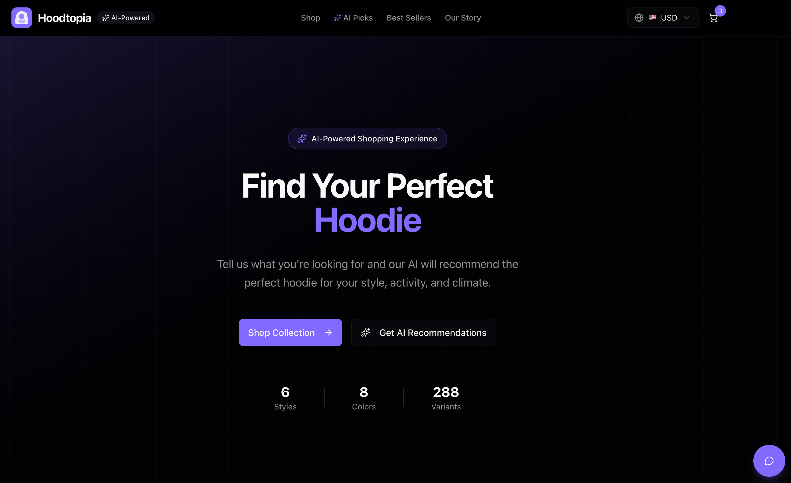

<div align="center">
  

  # Hoodtopia - AI-Powered E-commerce Demo

  > An AI-powered hoodie e-commerce application demonstrating AI in E-commerce, Agentic Commerce, and Generative UX for the **LangChain Stockholm Meetup**.

  [](https://github.com/your-username/hoodtopia/actions/workflows/ci.yml)
  
  
  
  
</div>

## Overview

**Hoodtopia** is a demo e-commerce application that showcases three key concepts:

1. **AI in E-commerce** - LLM-powered shopping assistance using OpenAI GPT-5.1
2. **Agentic Commerce** - Proactive AI agents guiding the shopping experience
3. **Generative UX** - Dynamic, personalized UI that adapts to shopper personas

### ✨ Core Features

**AI-Powered Shopping:**
- 🤖 AI Chat Assistant with GPT-5.1 for product recommendations
- 🔍 Semantic Search with natural language understanding
- 🎯 Personalized AI Picks based on browse history & preferences
- 🛒 Smart Cart Recommendations (complementary products)
- 📊 Product Comparison with AI insights

**Custom Design:**
- 🎨 AI Hoodie Designer powered by Google Gemini 3 Pro
- 🖼️ Text-to-image or image-to-design generation
- ✏️ Iterative refinement with AI feedback
- 💾 Custom design persistence & cart integration

**Shopper Profiles (Generative UX):**
- 👤 5 Adaptive Personas with unique UX transformations
  - 🎯 The Minimalist (fast, minimal, focused)
  - 📊 The Researcher (detailed specs, comparisons)
  - ✨ The Trendsetter (visual, style-focused)
  - 💰 The Budget Hunter (price-first, deals)
  - 🚀 The Explorer (discovery, variety)
- 🎨 Dynamic color theming per profile
- 📐 Adaptive layouts (single/grid/list/comparison/feed)
- 🗣️ Profile-specific AI personalities
- ⚡ Real-time UI transformations

**Checkout & Payments:**
- 💳 **Kustom Checkout** direct API integration (Create Order → Snippet → Read → Confirm)
- 🚚 **Kustom Shipping Assistant** — Hoodtopia implements the Integrator-side API for live shipping options
- 🧩 **Kustom On-site Elements** — `<kustom-payment-method-display>` on PDP and cart
- 📬 Push webhook → Order Management acknowledge with idempotent local sync

**Agent-to-agent commerce (A2A):**
- 🧩 **Three merchant agents** — checkout, shipping and claims — each with its own
  [A2A](https://a2a-protocol.org/latest/specification/) agent card and JSON-RPC endpoint
- 🔗 **They call each other**: checkout delegates rates to shipping; claims gathers
  evidence from both before deciding a refund or replacement
- ⏱️ **Long-running tasks** — parcel tracking stays open from label to doorstep
- 🖼️ **Multi-part messages** — a damage photo arrives as a file part
- 🔒 **JWS-signed agent cards** (A2A v1.0) — verified before the client transacts
- 💬 **Talk to them in plain language** — the agents read product, quantity and
  destination from a sentence, and ask rather than assume when it is not there
- 📺 **Live timeline** at [`/agents`](http://localhost:3005/agents), with the raw wire payload per hop

Runs with no database and no API keys. See [`docs/A2A_INTEGRATION.md`](./docs/A2A_INTEGRATION.md).

See [`docs/KUSTOM_INTEGRATION.md`](./docs/KUSTOM_INTEGRATION.md) for setup, and [`docs/DEPLOY.md`](./docs/DEPLOY.md) for shipping it to Vercel + a custom domain.

**Core E-commerce:**
- 💱 Multi-currency support (USD, SEK, JPY, GBP, EUR)
- 🛍️ Full shopping cart with session persistence
- 📱 Responsive dark-themed design
- 🖼️ AI-generated product images

## Tech Stack

| Category | Technology |
|----------|------------|
| **Framework** | Next.js 16 (App Router + Turbopack) |
| **Language** | TypeScript 5 |
| **Styling** | Tailwind CSS 4, shadcn/ui |
| **Commerce** | MedusaJS v2 (PostgreSQL) — catalog, cart, inventory, orders, promotions |
| **App data** | SQLite + Drizzle ORM — AI designs, chat, preferences (non-commerce) |
| **API Layer** | tRPC (BFF) + Medusa JS SDK + React Query |
| **Checkout** | Kustom Checkout (payment) over a Medusa cart |
| **AI Chat** | OpenAI GPT-5.1 via LangChain |
| **Image Gen** | Google Gemini 3 Pro Image Preview |
| **Validation** | Zod (structured AI outputs) |
| **Testing** | Vitest |

> **Commerce runs on MedusaJS.** Products, variants, inventory, cart, pricing,
> promotions, and orders live in a Medusa v2 backend (`medusa/`); Kustom stays
> the payment step over a Medusa cart. See
> [`docs/MEDUSA_INTEGRATION.md`](./docs/MEDUSA_INTEGRATION.md).

## Quick Start

### Prerequisites

- Node.js 20+ (check `.nvmrc`)
- npm or yarn
- OpenAI API key
- Google AI API key (for image generation)

### Installation

The app has **two parts**: the Medusa commerce backend (`medusa/`) and the
Next.js storefront (repo root). Full walkthrough in
[`docs/MEDUSA_INTEGRATION.md`](./docs/MEDUSA_INTEGRATION.md); in short:

```bash
git clone https://github.com/your-username/hoodtopia.git
cd hoodtopia

# 1. Medusa commerce backend (PostgreSQL via docker)
docker compose up -d medusa-db          # host port 5434
cd medusa && cp .env.template .env && npm install
npx medusa db:migrate
npx medusa user -e admin@hoodtopia.co -p supersecret
npm run seed && npm run seed:extras     # catalog + promos/collections/etc.
PORT=9010 npm run dev                   # API + admin on :9010/app

# 2. Storefront (separate shell, from repo root)
npm install
cp env.example .env.local               # add OPENAI/GEMINI keys + the Medusa
                                        # NEXT_PUBLIC_MEDUSA_* keys printed above
npm run db:push                         # non-commerce SQLite tables
npm run dev                             # storefront on :3005
```

Storefront: [http://localhost:3005](http://localhost:3005) ·
Admin: [http://localhost:9010/app](http://localhost:9010/app)
(`admin@hoodtopia.co` / `supersecret`)

> For a full checkout (Kustom callbacks must reach your machine), run the
> storefront via `npm run dev:tunnel` instead of `npm run dev`.

## Available Scripts

### Using Makefile (Recommended)

Run `make help` to see all available commands:

| Command | Description |
|---------|-------------|
| `make dev` | Start development server |
| `make build` | Build for production |
| `make test` | Run tests |
| `make lint` | Run ESLint |
| `make typecheck` | Run TypeScript type check |
| `make ci` | Run full CI pipeline locally |
| `make db-push` | Push database schema |
| `make db-seed` | Seed database with data |
| `make db-studio` | Open Drizzle Studio |
| `make db-reset` | Reset database completely |
| `make docker-build` | Build Docker image |
| `make docker-up` | Start Docker containers |
| `make docker-down` | Stop Docker containers |
| `make docker-logs` | View container logs |
| `make clean` | Clean build artifacts |

### Using npm directly

| Script | Description |
|--------|-------------|
| `npm run dev` | Start development server with Turbopack |
| `npm run build` | Build for production |
| `npm run start` | Start production server |
| `npm run lint` | Run ESLint |
| `npm run lint:fix` | Run ESLint with auto-fix |
| `npm run typecheck` | Run TypeScript type checking |
| `npm run test` | Run tests with Vitest (watch mode) |
| `npm run test:run` | Run tests once (CI mode) |
| `npm run ci` | Run full CI pipeline locally |
| `npm run db:push` | Push schema changes to database |
| `npm run db:seed` | Seed database with products |
| `npm run db:studio` | Open Drizzle Studio |
| `npm run generate:images` | Generate all hoodie images with Gemini |
| `npm run generate:accessories` | Generate all accessory images |

## Project Structure

```
src/
├── app/                    # Next.js App Router pages
│   ├── page.tsx           # Homepage
│   ├── products/          # Product listing & details
│   ├── cart/              # Shopping cart
│   ├── faq/               # FAQ page
│   └── api/trpc/          # tRPC API handler
│
├── components/
│   ├── ui/                # shadcn/ui components
│   ├── layout/            # Header, Footer
│   ├── home/              # Homepage sections
│   ├── products/          # Product cards, grids, comparisons, AI recommendations
│   ├── cart/              # Cart items, recommendations
│   ├── profiles/          # Shopper profile selector & banner
│   └── ai/                # AI chat components
│
├── server/
│   ├── trpc.ts            # tRPC setup
│   └── routers/           # API routers (products, cart, ai)
│
├── services/
│   ├── ai.ts              # OpenAI GPT-5.1 integration with profile support
│   ├── image-generation.ts # Google Gemini image generation
│   └── schemas.ts         # Zod schemas for structured AI outputs
│
├── lib/
│   ├── utils.ts           # Utility functions
│   ├── trpc.ts            # tRPC client
│   ├── currency.tsx       # Currency context
│   └── shopper-profiles.tsx # Profile context & config
│
├── hooks/
│   └── use-browse-history.ts # Browse history tracking
│
├── lib/commerce/          # Medusa seam: SDK clients + product/cart adapters
│
├── db/
│   ├── schema.ts          # Drizzle schema (non-commerce: designs, chat, prefs)
│   └── index.ts           # DB connection
│
└── scripts/
    ├── generate-images.ts          # Hoodie image generation
    └── generate-accessory-images.ts # Accessory image generation
```

> Commerce lives in `medusa/` (MedusaJS v2 + PostgreSQL). The product/cart
> seed is `medusa/src/scripts/seed.ts`.

## Data stores

**Commerce → MedusaJS (PostgreSQL):** 19 products / 301 variants (color×size),
multi-currency pricing, cart, inventory, promotions, and orders. Seeded by
`medusa/src/scripts/seed.ts` (+ `seed-extras.ts`).

**App data → SQLite + Drizzle** (non-commerce only):

- **customDesigns** - AI-generated custom hoodie design metadata
- **chatMessages** / **chatSafetyEvents** - AI chat history + guardrail audit
- **userPreferences** - personalization preferences
- **medusa_carts** - session → Medusa cart-id pointer

### Product Categories

**Hoodies:**
- Classic Comfort Hoodie ($59.99)
- Tech Fleece Pro ($89.99)
- Athletic Performance Hoodie ($79.99)
- Oversized Street Hoodie ($69.99)
- Premium Zip-Up ($99.99)
- Heavyweight Winter Hoodie ($109.99)

**Accessories:**
- Stickers, pins, patches
- Mini hoodie keychain
- Cozy club socks
- Canvas tote bag
- Hoodie care kit
- Hoodie shaped mug

## AI Features

### LangChain vs Native API Implementation

This project demonstrates a **hybrid approach** to AI integration, using LangChain where it adds value and native APIs where needed:

| Feature | Status | Implementation | Why? |
|---------|--------|----------------|------|
| **AI Chat Assistant** | ✅ | **LangChain** (OpenAI) | Structured outputs, message chains |
| **Product Recommendations** | ✅ | **LangChain** (OpenAI) | Zod schema validation |
| **Semantic Search** | ✅ | **LangChain** (OpenAI) | Consistent API, easy prompting |
| **Cart Intelligence** | ✅ | **LangChain** (OpenAI) | Structured JSON responses |
| **Custom Image Generation** | ✅ | **Native Gemini API** | Image-specific features |
| **Image Refinement** | ✅ | **Native Gemini API** | Direct model control |

**Key Insight:** Use LangChain for text/chat tasks with structured outputs. Use native APIs for specialized features like image generation.

---

### 1. AI Chat Assistant

Powered by **OpenAI GPT-5.1**, the chat assistant understands natural language and adapts to shopper profiles:

```typescript
// Example interactions
User: "I need a warm hoodie for winter running"
AI (Default): Recommends Athletic Performance or Heavyweight Winter Hoodie with detailed reasoning

User: "I need a warm hoodie for winter running"
AI (Minimalist): "Athletic Performance Hoodie, $79.99. Perfect for winter running."

User: "I need a warm hoodie for winter running"
AI (Researcher): "Athletic Performance Hoodie uses 85% polyester thermal fabric (warmth rating: 8/10)
                  vs Heavyweight Winter at 90% cotton (warmth: 9/10, weight: 16oz vs 14oz)..."
```

**Features:**
- Natural language understanding
- Profile-adaptive responses (5 personalities)
- Product recommendations with reasoning
- Conversation context maintenance
- Structured outputs via Zod schemas

### 2. AI Product Recommendations

Get personalized recommendations based on:
- User preferences & natural language input
- Browse history tracking
- Saved user preferences
- Shopper profile personality

```typescript
// Recommendation flow
Input: "casual everyday wear, earth tones, under $70"
Context: Browse history shows interest in Classic/Athletic styles
Profile: Budget Hunter (price-focused)

Output:
- Classic Comfort Hoodie ($59.99) - 95% confidence
  Reason: "Best value! Fits your budget and style. Earth tone colors available."
- Athletic Performance ($79.99) - 60% confidence
  Reason: "Slightly over budget but great quality-to-price ratio."
```

### 3. Semantic Search

AI-powered search that understands intent:

```typescript
Search: "something cozy for netflix"
→ Finds: Classic Comfort Hoodie, Heavyweight Winter Hoodie

Search: "gym workout athletic"
→ Finds: Athletic Performance Hoodie, Tech Fleece Pro
```

### 4. Cart Intelligence

AI analyzes cart contents and suggests complementary products:

```typescript
Cart: [Athletic Performance Hoodie]

AI Recommendations:
- Cozy Club Socks ($12.99) - "Complete your athletic look"
- Hoodie Care Kit ($24.99) - "Keep your hoodie fresh"
- Canvas Tote Bag ($19.99) - "Perfect for gym essentials"
```

**Analysis types:**
- Accessory recommendations
- Matching items
- Complete-the-look suggestions

### 5. Custom Hoodie Designer

Generate custom hoodies using **Google Gemini 3 Pro Image Preview**:

**Text-to-Design:**
```typescript
Input: "A galaxy-themed hoodie with purple nebula clouds"
→ AI generates photorealistic product image with design printed on hoodie
```

**Image-to-Design:**
```typescript
Input: [Upload your artwork/photo]
→ AI transforms it into a professional hoodie mockup
```

**Features:**
- 2K resolution, photorealistic images
- Iterative refinement with AI feedback
- Base color & hoodie type selection
- Fixed $100 pricing
- Database persistence
- Refinement history tracking

### 6. Shopper Profiles (Generative UX)

**5 adaptive personas** that transform the entire UI and AI behavior:

#### 🎯 The Minimalist
- **UI:** Single column, tight spacing, medium images
- **Price:** Prominent (huge font)
- **Buttons:** Quick Buy
- **AI:** Ultra-concise (1-2 sentences)
- **Theme:** Black & white
- **Animations:** Disabled

#### 📊 The Researcher
- **UI:** 2-column comparison layout
- **Specs:** Full details, materials, features
- **Reviews:** Shown
- **AI:** Detailed specs, comparisons, data-driven
- **Theme:** Blue tones
- **Animations:** Disabled

#### ✨ The Trendsetter
- **UI:** 4-column grid, large images, relaxed spacing
- **AI:** Enthusiastic, style-focused, outfit suggestions
- **Theme:** Pink & gold
- **Animations:** Enabled with hover effects

#### 💰 The Budget Hunter
- **UI:** List view, small images, tight spacing
- **Price:** Prominent with value messaging
- **Buttons:** Quick Buy
- **AI:** Price-first, cost comparisons, deals
- **Theme:** Green & gold
- **Animations:** Disabled

#### 🚀 The Explorer
- **UI:** Feed layout, large images, relaxed spacing
- **AI:** Playful, discovery-focused, unexpected suggestions
- **Theme:** Purple & pink
- **Animations:** Enabled

**Implementation:**
- Real-time UI transformations
- Profile persistence (localStorage)
- Color theming per profile
- Adaptive layouts & spacing
- Profile-specific AI prompts
- Visual profile banner
- Default Mode option

## Environment Variables

Create a `.env.local` file with:

```env
# Required
OPENAI_API_KEY=sk-...

# Required for image generation
GOOGLE_AI_API_KEY=...

# Optional
DATABASE_URL=./db/hoodtopia.db

# Kustom Checkout (Playground) — see docs/KUSTOM_INTEGRATION.md
KUSTOM_API_BASE_URL=https://api.playground.kustom.co
KUSTOM_USERNAME=MID-xxxxxxxx
KUSTOM_API_KEY=kco_test_api_...
KUSTOM_MERCHANT_ID=xxxxxxxx
NEXT_PUBLIC_SITE_URL=http://localhost:3000

# Kustom Shipping Assistant (optional)
KUSTOM_SHIPPING_KEY=<shared-secret>
KUSTOM_SHIPPING_JWT_SECRET=<random-min-32-chars>

# Kustom On-site Elements (optional)
NEXT_PUBLIC_KUSTOM_ELEMENTS_SRC=https://elements.kustom.co/v1/loader.js
NEXT_PUBLIC_KUSTOM_MERCHANT_ID=xxxxxxxx
```

Get Kustom Playground credentials from <https://portal.playground.kustom.co/onboarding>.

## Image Generation

Product images are generated using Google Gemini 3 Pro:

```bash
# Generate all hoodie images (48 total: 6 products × 8 colors)
npm run generate:images

# Generate all accessory images (13 total)
npm run generate:accessories

# Test with single image
npm run generate:images:test
npm run generate:accessories:test
```

## Development

### Type Checking

```bash
# Run TypeScript compiler
npx tsc --noEmit
```

### Database Management

```bash
# View database in browser
npm run db:studio

# Reset and re-seed
rm db/hoodtopia.db
npm run db:push
npm run db:seed
```

## Deployment

### Docker (Recommended for Production)

**Using Makefile (Easiest):**
```bash
# Build and start
make docker-build
make docker-up

# View logs
make docker-logs

# Stop
make docker-down
```

**Using Docker Compose:**
```bash
# Start production containers
docker-compose up -d

# Start development containers with hot reload
docker-compose --profile dev up -d

# View logs
docker-compose logs -f

# Stop
docker-compose down
```

**Using Docker directly:**
```bash
# Build
docker build -t hoodtopia:latest .

# Run
docker run -p 3000:3000 \
  -e OPENAI_API_KEY=your_key \
  -e GOOGLE_AI_API_KEY=your_key \
  hoodtopia:latest
```

**Environment Variables:**
Create a `.env` file for docker-compose:
```env
OPENAI_API_KEY=sk-...
GOOGLE_AI_API_KEY=...
```

### Vercel

```bash
# Install Vercel CLI
npm i -g vercel

# Deploy
vercel
```

## Contributing

1. Fork the repository
2. Create a feature branch (`git checkout -b feature/amazing-feature`)
3. Commit changes (`git commit -m 'Add amazing feature'`)
4. Push to branch (`git push origin feature/amazing-feature`)
5. Open a Pull Request

## License

MIT License - see [LICENSE](LICENSE) for details.

## Acknowledgments

- Built for the **LangChain Stockholm Meetup**
- UI components from [shadcn/ui](https://ui.shadcn.com/)
- Icons from [Lucide](https://lucide.dev/)

---

<div align="center">
  <p><em>This is a demo application. No real transactions are processed.</em></p>

  <br/>

  <p>
    Made with ❤️ in Stockholm, Sweden
  </p>

  <p>
    <sub>Showcasing the future of AI-powered e-commerce</sub>
  </p>
</div>
