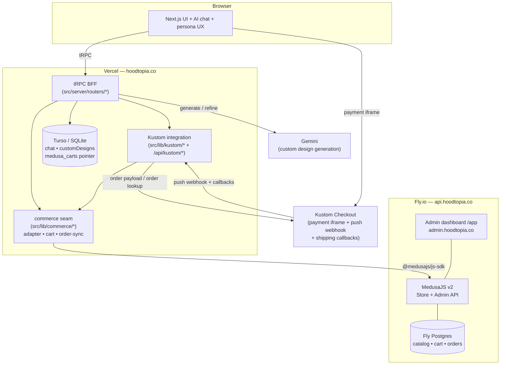
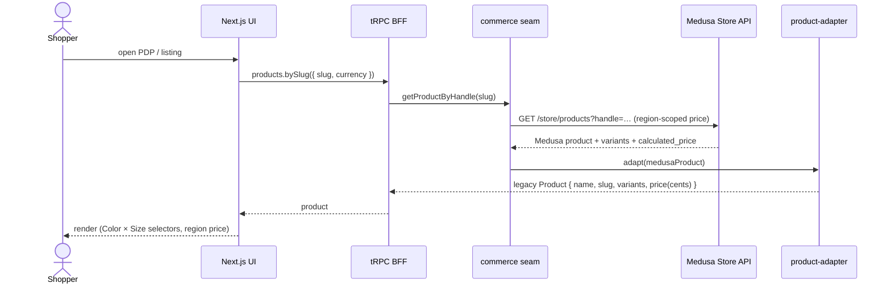
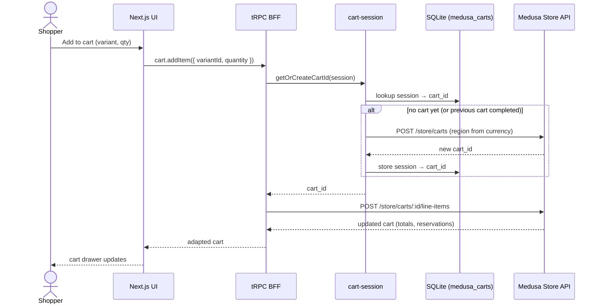
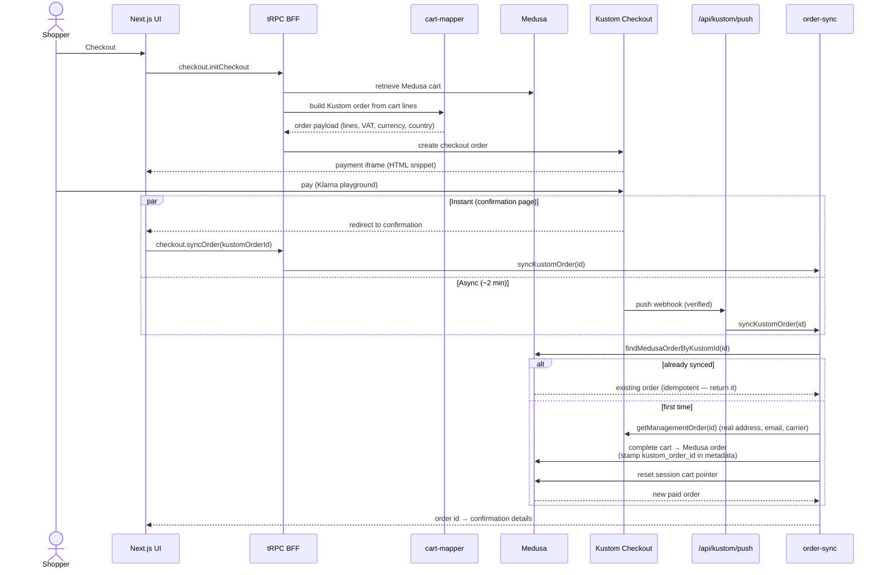

# Architecture

How the Hoodtopia store works after the MedusaJS migration. This is the
top-level map; the two deep-dives are
[`MEDUSA_INTEGRATION.md`](./MEDUSA_INTEGRATION.md) (commerce layer) and
[`KUSTOM_INTEGRATION.md`](./KUSTOM_INTEGRATION.md) (payment + shipping).

## The one-paragraph version

The storefront is a **Next.js app** that talks to its own **tRPC BFF**. The BFF
no longer owns commerce data — it proxies a real **MedusaJS v2** backend (the
catalog, variants, inventory, pricing/regions, promotions, cart, and orders).
**Kustom Checkout** stays the payment step: Medusa owns the cart, Kustom takes
the payment, and the Kustom push webhook (plus an instant confirmation-page
sync) **completes the Medusa cart into a paid Medusa order**. A thin SQLite/Turso
DB holds only non-commerce data (AI chat, custom-design metadata, the
session→cart pointer). AI chat and custom AI designs read product/cart data from
Medusa through an adapter, so the UI/AI components were left untouched.

## Components



**Who owns what**

| Concern | Owner |
| --- | --- |
| Catalog, variants, images, inventory | Medusa |
| Pricing, regions/markets, currencies | Medusa (5 regions: US/SE/GB/DE/JP) |
| Cart, promotions | Medusa |
| Orders (source of truth) | Medusa |
| Payment, shipping assistant | Kustom Checkout |
| AI chat, persona UX, currency switcher UX | storefront (reads Medusa) |
| Custom AI design generation | storefront (Gemini) → one-off Medusa product |
| Chat history, design metadata, session→cart pointer | SQLite/Turso |

The storefront never queries the commerce tables directly — every read/write
goes through the **commerce seam** (`src/lib/commerce/*`), which calls Medusa via
`@medusajs/js-sdk` and maps Medusa shapes back to the legacy
`Product`/`ProductVariant`/cart shapes the UI already consumed. That seam is what
let the migration keep the UI and AI components unchanged.

## Request paths

Two distinct origins, deliberately kept separate:

- **`hoodtopia.co`** — the storefront: tRPC, the Kustom callbacks/webhook, the
  product feed, and the AI endpoints.
- **`api.hoodtopia.co`** — **Medusa only** (Store + Admin API; admin dashboard at
  `/app`, also fronted by `admin.hoodtopia.co`).

Every UI/AI component still calls tRPC and never touches Medusa or Kustom
directly:

```
component → tRPC (BFF) → @medusajs/js-sdk → Medusa Store API → adapter → legacy shape
```

## Sequence: browse a product



The adapter does the unglamorous-but-critical mapping: `title→name`,
`handle→slug`, `calculated_price ×100 → cents`, `metadata.features → JSON
string`, option `Color`/`Size → color`/`size`, `metadata.colorHex → colorHex`.

## Sequence: add to cart



Inventory is **Medusa's** job now — there's no manual stock decrement. The only
thing SQLite stores is the `session → cart_id` pointer (`medusa_carts`); the cart
contents live entirely in Medusa.

## Sequence: checkout → paid Medusa order

This is the heart of the design. Kustom takes the payment; Medusa stays the order
source of truth. The order gets synced **twice on purpose** — an instant sync
from the confirmation page so the shopper sees their order immediately, and the
async push webhook ~2 min later as the durable backstop. Both go through the same
idempotent `syncKustomOrder`, so whichever wins, the order is created exactly
once.



Key properties of the sync (`src/lib/commerce/order-sync.ts`):

- **Idempotent** — `findMedusaOrderByKustomId` is the dedup key; the second
  trigger to arrive returns the existing order instead of double-completing.
- **Faithful** — the Medusa order carries the customer's real shipping/billing
  address, email, phone, and the **shipping carrier they actually chose** in
  Kustom (mapped to the matching Medusa shipping option by code), not the cart's
  placeholder.
- **Self-cleaning** — on success the session→cart pointer is reset so the next
  visit starts a fresh cart.

## Promotions & stock during checkout

- **Promotions** are Medusa promotions applied to the cart (`cart.applyPromo`),
  then flowed to Kustom as a negative `discount` order line so the payment total
  matches. Percentage promos are currency-agnostic, so they work in every market.
  Seeded: `WELCOME10`, `HOODIE20`, `FREESHIP`.
- **Stock re-validation** — Kustom's `validation`/`upsell` callbacks re-check
  inventory against **Medusa** (`getStockBySku`) for `physical`/`digital` lines
  only (discount/shipping/tax lines have no SKU).

## Custom AI designs

A Gemini-generated design added to cart becomes a **real, one-off Medusa
product** (`category: custom`, one variant per design+size, no inventory
tracking, $100 across all 5 currencies) created via the Admin API, then added to
the Medusa cart like any other product. The Gemini design record (prompt,
refinement history) stays in SQLite (`customDesigns`) — it's design metadata, not
commerce data.

## What still lives in SQLite/Turso

Only non-commerce tables survived the migration:

- `customDesigns` — Gemini design metadata
- `chatMessages`, `chatSafetyEvents` — AI chat history + safety log
- `userPreferences` — persona/UX prefs
- `medusa_carts` — the session → Medusa-cart-id pointer

Everything else (products, variants, images, carts, inventory, orders) is in
Medusa/Postgres.

## Deployment topology

| Piece | Where | Port (dev) | URL (prod) |
| --- | --- | --- | --- |
| Storefront (Next.js) | repo root `src/` | 3005¹ | `hoodtopia.co` (Vercel) |
| Store/Admin API (Medusa) | `medusa/` | 9010¹ | `api.hoodtopia.co` (Fly.io) |
| Admin dashboard | served by Medusa at `/app` | 9010/app | `admin.hoodtopia.co` |
| Database | PostgreSQL | docker `:5434`¹ | Fly Postgres |
| Non-commerce DB | libSQL/SQLite | local file | Turso |

> ¹ Non-default local ports: a `pimir-minio` container squats `:9000` on the dev
> machine, so Medusa runs on **9010** and Postgres on **5434**, and the
> storefront on **3005**. Prod uses the standard subdomains.

Deploy guides: [`DEPLOY.md`](./DEPLOY.md) (storefront → Vercel),
[`DEPLOY_MEDUSA.md`](./DEPLOY_MEDUSA.md) (Medusa → Fly.io).

## See also

- [`MEDUSA_INTEGRATION.md`](./MEDUSA_INTEGRATION.md) — the commerce seam in
  detail (adapter field mappings, cart wrappers, order-sync, regions, local
  setup).
- [`KUSTOM_INTEGRATION.md`](./KUSTOM_INTEGRATION.md) — the Kustom side (iframe,
  shipping assistant callbacks, push webhook, KSA).
- [`MEDUSA_REFACTOR_PLAN.md`](./MEDUSA_REFACTOR_PLAN.md) — the phased migration
  plan and commit map.
